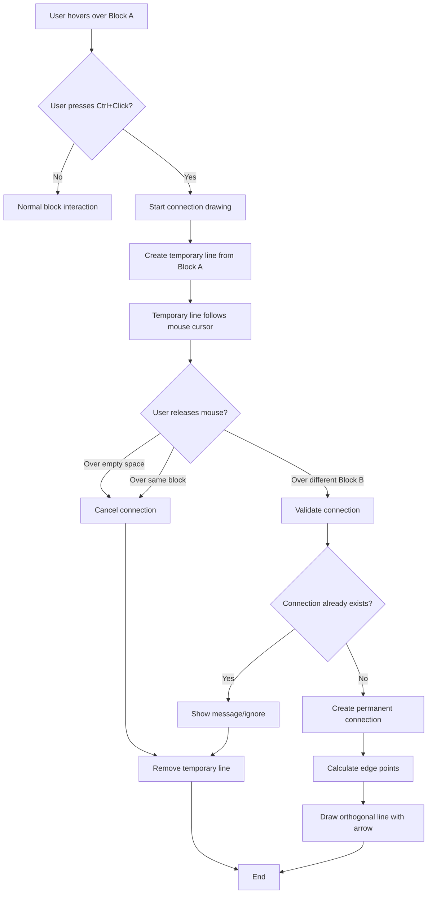
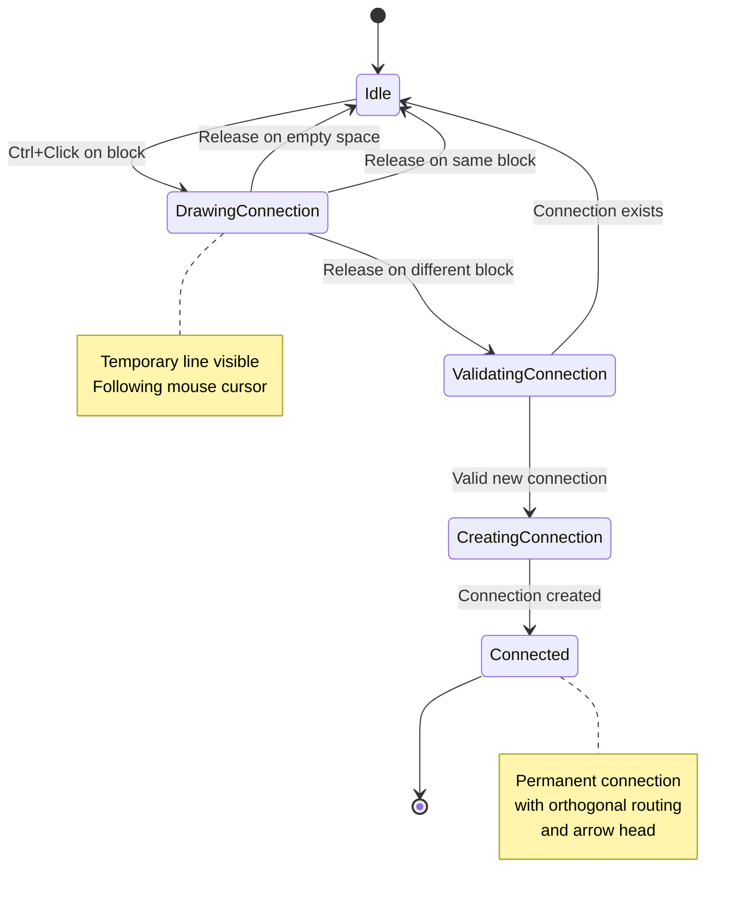
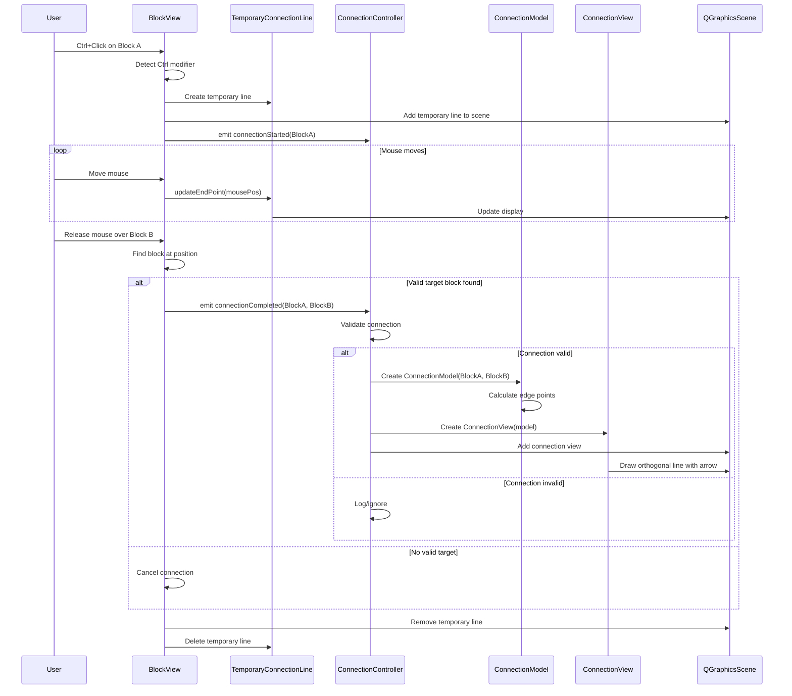
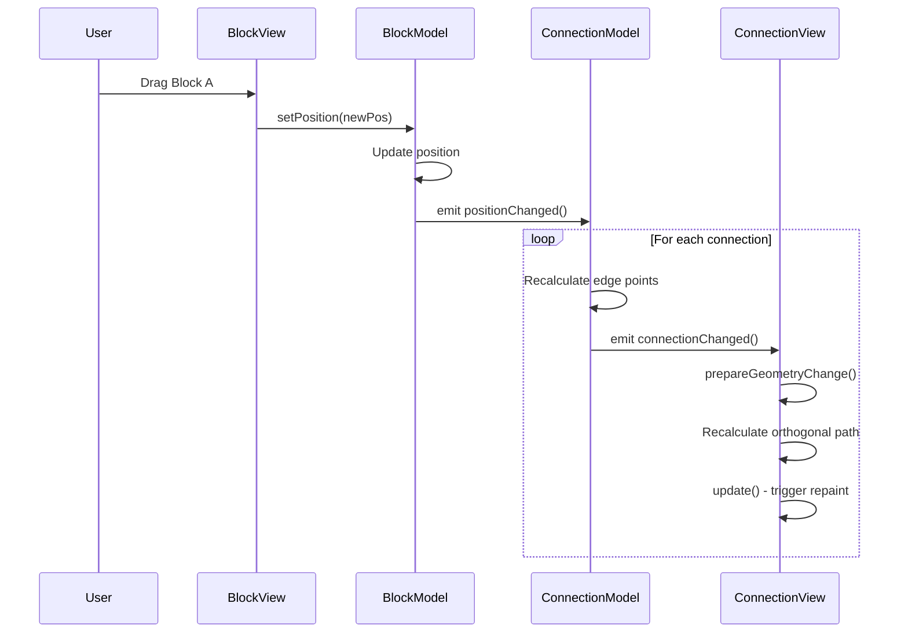

# Connection Drawing Workflow

## User Interaction Flow



## State Transitions



## Component Interaction Sequence



## Connection Drawing States

### State 1: Idle
```
┌─────────────┐     ┌─────────────┐
│   Block A   │     │   Block B   │
│             │     │             │
└─────────────┘     └─────────────┘

User can:
- Move blocks
- Resize blocks
- Edit titles
- Ctrl+Click to start connection
```

### State 2: Drawing Connection
```
┌─────────────┐     ┌─────────────┐
│   Block A   │     │   Block B   │
│      ●------│-----│----→ ✕      │  ← Mouse cursor
└─────────────┘     └─────────────┘
      ↑
   Start point
   (edge of Block A)

Temporary dashed line follows cursor
User can:
- Move mouse to target
- Release to complete
- Release on empty space to cancel
```

### State 3: Connection Complete
```
┌─────────────┐     ┌─────────────┐
│   Block A   ├──┐  │   Block B   │
│             │  │  │             │
└─────────────┘  │  └─────────────┘
                 │         ▲
                 └─────────┤
                           │
                      Arrow head

Permanent orthogonal line with arrow
Automatically updates when blocks move
```

## Edge Point Calculation

```
Block Rectangle with Edge Points:

        Top Edge (center.x, rect.top)
              ●
              │
    ┌─────────┼─────────┐
    │         │         │
Left│    ●────┼────●    │Right
Edge│  (center)         │Edge
    │                   │
    └───────────────────┘
              │
              ●
        Bottom Edge
```

### Algorithm:
1. Calculate vector from block center to target point
2. Determine if horizontal or vertical component is larger
3. If horizontal dominant:
   - Use right edge if target is right of center
   - Use left edge if target is left of center
4. If vertical dominant:
   - Use bottom edge if target is below center
   - Use top edge if target is above center

## Orthogonal Routing

### 3-Segment Routing (Simple)
```
Start Block              End Block
┌─────────┐             ┌─────────┐
│         ├──→          │         │
└─────────┘  │          └─────────┘
             │               ▲
             │               │
             └───────────────┘
             
Segments:
1. Horizontal from start edge
2. Vertical to end height
3. Horizontal to end edge
```

### Example Scenarios:

#### Scenario A: Blocks side-by-side
```
┌─────┐         ┌─────┐
│  A  ├────────→│  B  │
└─────┘         └─────┘
```

#### Scenario B: Blocks vertically aligned
```
┌─────┐
│  A  │
└──┬──┘
   │
   │
   ↓
┌─────┐
│  B  │
└─────┘
```

#### Scenario C: Diagonal arrangement
```
┌─────┐
│  A  ├──┐
└─────┘  │
         │
         ↓
      ┌─────┐
      │  B  │
      └─────┘
```

## Arrow Head Drawing

```
Direction calculation:
                ↑ Last segment direction
                │
                │
         ┌──────┴──────┐
         │      ●       │  ← End point
         │    ╱   ╲    │
         │  ╱       ╲  │
         │●           ●│  ← Arrow points
         └─────────────┘

Arrow head is filled triangle:
- Point 1: End point
- Point 2: End point + offset at angle + 30°
- Point 3: End point + offset at angle - 30°
```

## Block Movement Updates



## Key Features Summary

1. **Ctrl+Click Initiation**: Intuitive gesture to start connection
2. **Visual Feedback**: Temporary line shows what you're doing
3. **Smart Cancellation**: Release on empty space = no connection
4. **Edge Attachment**: Connections attach to nearest block edge
5. **Orthogonal Routing**: Professional right-angled lines
6. **Directional Arrows**: Clear indication of flow direction
7. **Auto-Update**: Connections follow blocks when moved
8. **Duplicate Prevention**: Can't create same connection twice
9. **Bidirectional Support**: A→B and B→A are different connections

## Implementation Priority

### Phase 1 (Core Functionality)
- Ctrl+Click detection
- Temporary line creation
- Basic connection completion

### Phase 2 (Visual Enhancement)
- Edge point calculation
- Orthogonal routing
- Arrow heads

### Phase 3 (Polish)
- Auto-updates on block move
- Connection validation
- Error handling