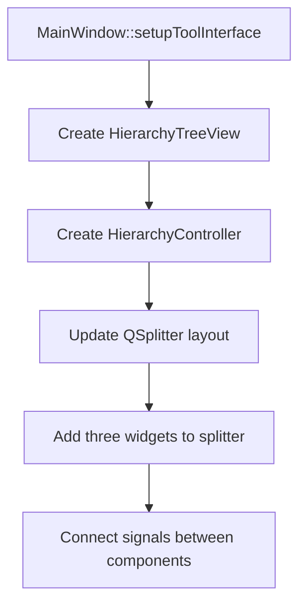
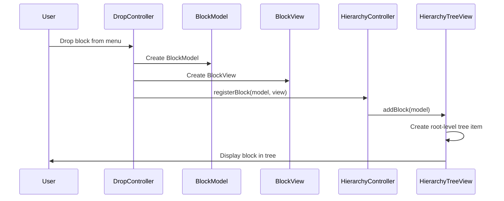
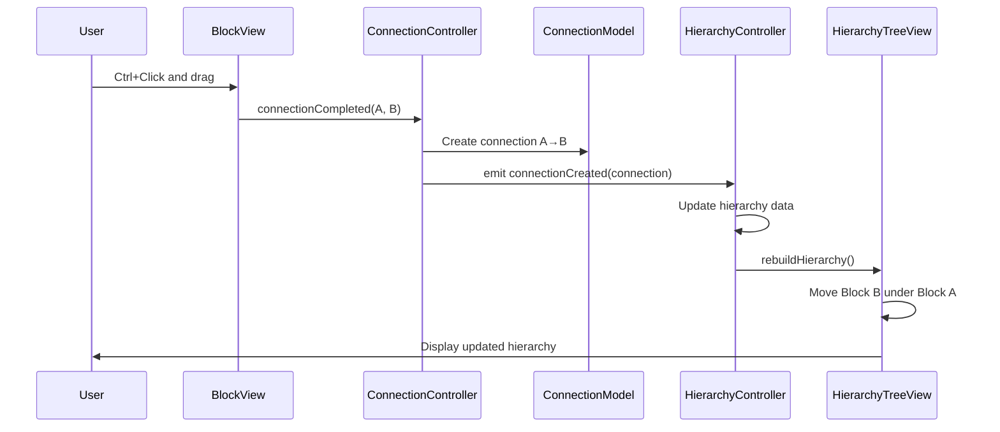
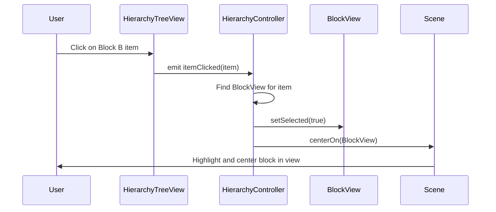

# Hierarchical Block Tree View - Design Document

## Overview
This document outlines the design for a hierarchical tree view that displays blocks and their connection relationships. When a connection is drawn from Block A to Block B, Block B appears as a child of Block A in the tree.

## Current UI Layout Analysis

### Existing Layout Structure
```
MainWindow
└── QSplitter (Horizontal)
    ├── BlockMenuView (Left - 25%)
    └── DropGraphicsView (Right - 75%)
```

### Proposed Layout Structure
```
MainWindow
└── QSplitter (Horizontal - Main)
    ├── BlockMenuView (Left - 20%)
    ├── DropGraphicsView (Center - 60%)
    └── HierarchyTreeView (Right - 20%)
```

## Component Architecture

### 1. HierarchyTreeView (View Component)

**File**: `headers/views/hierarchytreeview.h`, `src/views/hierarchytreeview.cpp`

**Purpose**: Display blocks in a hierarchical tree structure based on connections

**Base Class**: `QTreeWidget`

**Key Features**:
- Display block names with color indicators
- Show parent-child relationships based on connections
- Support item selection and highlighting
- Auto-expand/collapse functionality

**Public Interface**:
```cpp
class HierarchyTreeView : public QTreeWidget
{
    Q_OBJECT

public:
    explicit HierarchyTreeView(QWidget *parent = nullptr);
    
    void addBlock(BlockModel *block);
    void removeBlock(BlockModel *block);
    void updateBlockHierarchy();
    void highlightBlock(BlockModel *block);
    void clearHighlight();

signals:
    void blockSelected(BlockModel *block);
    void blockDoubleClicked(BlockModel *block);

private:
    QMap<QString, QTreeWidgetItem*> m_blockItems;
    void setupTreeWidget();
};
```

### 2. HierarchyController (Controller Component)

**File**: `headers/controllers/hierarchycontroller.h`, `src/controllers/hierarchycontroller.cpp`

**Purpose**: Manage synchronization between blocks, connections, and tree view

**Key Responsibilities**:
- Track all blocks and their connections
- Build and maintain hierarchy data structure
- Update tree view when connections change
- Handle block selection events
- Coordinate with ConnectionController

**Public Interface**:
```cpp
class HierarchyController : public QObject
{
    Q_OBJECT

public:
    explicit HierarchyController(HierarchyTreeView *treeView, 
                                 ConnectionController *connectionController,
                                 QObject *parent = nullptr);
    
    void registerBlock(BlockModel *block, BlockView *view);
    void unregisterBlock(BlockModel *block);
    void rebuildHierarchy();

private slots:
    void onConnectionCreated(ConnectionModel *connection);
    void onConnectionRemoved(ConnectionModel *connection);
    void onBlockSelected(BlockModel *block);
    void onTreeItemClicked(QTreeWidgetItem *item, int column);

private:
    HierarchyTreeView *m_treeView;
    ConnectionController *m_connectionController;
    QMap<QString, BlockModel*> m_blocks;
    QMap<QString, BlockView*> m_blockViews;
    QList<ConnectionModel*> m_connections;
    
    void buildHierarchyTree();
    QList<BlockModel*> getRootBlocks();
    QList<BlockModel*> getChildBlocks(BlockModel *parent);
};
```

## Data Structure Design

### Hierarchy Representation

**Root Blocks**: Blocks with no incoming connections
**Child Blocks**: Blocks with incoming connections from a parent

```
Tree Structure Example:

Root Blocks (no incoming connections)
├── Block A
│   ├── Block B (A → B)
│   └── Block C (A → C)
│       └── Block D (C → D)
├── Block E
│   └── Block F (E → F)
└── Block G (orphaned, no connections)
```

### Connection Tracking

```cpp
// For each block, track:
struct BlockHierarchyInfo {
    BlockModel *block;
    QList<BlockModel*> parents;    // Blocks with connections TO this block
    QList<BlockModel*> children;   // Blocks with connections FROM this block
    bool isRoot;                   // Has no incoming connections
};
```

## Implementation Flow

### 1. Initial Setup (MainWindow)



### 2. Block Addition Flow



### 3. Connection Creation Flow



### 4. Tree Item Selection Flow



## UI Design Specifications

### Tree Widget Configuration

```cpp
// Column setup
setColumnCount(1);
setHeaderLabel("Block Hierarchy");

// Visual styling
setAlternatingRowColors(true);
setAnimated(true);
setExpandsOnDoubleClick(true);

// Selection behavior
setSelectionMode(QAbstractItemView::SingleSelection);
setSelectionBehavior(QAbstractItemView::SelectRows);
```

### Tree Item Appearance

```
📦 Root Blocks
├── 🔴 Red Block
│   ├── 🔵 Blue Block
│   └── 🟢 Green Block
└── 🔵 Blue Block 2
    └── 🔴 Red Block 2
```

**Visual Elements**:
- Color indicator (colored square icon matching block color)
- Block label text
- Indentation showing hierarchy level
- Expand/collapse arrows for parent blocks

### Highlighting Behavior

**When tree item is clicked**:
1. Tree item background changes to selection color
2. Corresponding block in scene gets selection border
3. View scrolls/centers on the selected block

**When block in scene is clicked**:
1. Block gets selection border
2. Corresponding tree item is highlighted
3. Tree scrolls to show the item

## Edge Cases and Solutions

### 1. Multiple Parents (Diamond Pattern)

```
Problem:
    A → C
    B → C
    
Where does C appear in tree?
```

**Solution**: Display C under the first parent (A), with a visual indicator showing it has multiple parents. Add tooltip showing all parent blocks.

### 2. Circular Connections

```
Problem:
    A → B → C → A
    
Creates infinite loop in hierarchy
```

**Solution**: Detect cycles during hierarchy building. Display cyclic blocks at root level with a warning icon and tooltip indicating the cycle.

### 3. Orphaned Blocks

```
Problem:
    Block with no connections
```

**Solution**: Display at root level under "Unconnected Blocks" section or directly at root level.

### 4. Connection Deletion

```
Problem:
    A → B (delete connection)
    Where does B go?
```

**Solution**: 
- If B has other incoming connections, move under next parent
- If B has no incoming connections, move to root level
- Rebuild hierarchy to reflect new structure

## Integration Points

### MainWindow Changes

```cpp
// Add new member variables
HierarchyTreeView *hierarchyTreeView;
HierarchyController *hierarchyController;

// Update setupToolInterface()
void MainWindow::setupToolInterface()
{
    // ... existing code ...
    
    // Create hierarchy tree view
    hierarchyTreeView = new HierarchyTreeView(this);
    
    // Create hierarchy controller
    hierarchyController = new HierarchyController(
        hierarchyTreeView, 
        connectionController, 
        this
    );
    
    // Update splitter to have 3 widgets
    splitter = new QSplitter(Qt::Horizontal, this);
    splitter->addWidget(blockMenuView);
    splitter->addWidget(dropGraphicsView);
    splitter->addWidget(hierarchyTreeView);
    splitter->setStretchFactor(0, 1);  // Block menu
    splitter->setStretchFactor(1, 3);  // Graphics view
    splitter->setStretchFactor(2, 1);  // Hierarchy tree
    
    setCentralWidget(splitter);
}
```

### ConnectionController Changes

```cpp
// Add signal for hierarchy controller
signals:
    void connectionCreated(ConnectionModel *connection);
    void connectionRemoved(ConnectionModel *connection);

// Emit in onConnectionCompleted()
void ConnectionController::onConnectionCompleted(...)
{
    // ... existing code ...
    emit connectionCreated(connection);
}
```

### DropController Changes

```cpp
// Notify hierarchy controller when blocks are created
void DropController::handleDrop(...)
{
    // ... existing code ...
    emit blockCreated(blockModel, blockView);
}
```

## File Structure

```
New Files:
├── headers/
│   ├── views/
│   │   └── hierarchytreeview.h
│   └── controllers/
│       └── hierarchycontroller.h
└── src/
    ├── views/
    │   └── hierarchytreeview.cpp
    └── controllers/
        └── hierarchycontroller.cpp

Modified Files:
├── headers/
│   ├── mainwindow.h
│   └── controllers/
│       ├── connectioncontroller.h
│       └── dropcontroller.h
└── src/
    ├── mainwindow.cpp
    └── controllers/
        ├── connectioncontroller.cpp
        └── dropcontroller.cpp
```

## Testing Scenarios

1. **Basic Hierarchy**
   - Create Block A
   - Create Block B
   - Connect A → B
   - Verify B appears under A in tree

2. **Multi-level Hierarchy**
   - Create A, B, C, D
   - Connect A → B → C → D
   - Verify 4-level hierarchy displays correctly

3. **Multiple Children**
   - Create A, B, C, D
   - Connect A → B, A → C, A → D
   - Verify all three children under A

4. **Tree Selection**
   - Click tree item
   - Verify block highlights in scene
   - Verify view centers on block

5. **Scene Selection**
   - Click block in scene
   - Verify tree item highlights
   - Verify tree scrolls to item

6. **Connection Deletion**
   - Create A → B
   - Delete connection
   - Verify B moves to root level

7. **Block Deletion**
   - Create A → B → C
   - Delete B
   - Verify C moves to root level
   - Verify tree updates correctly

## Performance Considerations

- **Lazy Loading**: Only rebuild hierarchy when connections change
- **Incremental Updates**: Update specific tree items rather than full rebuild when possible
- **Caching**: Cache parent-child relationships to avoid repeated calculations
- **Batch Updates**: Group multiple changes into single tree update

## Future Enhancements

1. **Search/Filter**: Add search box to filter blocks by name
2. **Drag-and-Drop**: Allow reordering blocks in tree (creates/modifies connections)
3. **Context Menu**: Right-click menu for quick actions (delete, rename, etc.)
4. **Export**: Export hierarchy as text or image
5. **Collapse All/Expand All**: Buttons for tree navigation
6. **Color Coding**: Different colors for different block types or states
7. **Connection Count**: Show number of connections for each block
8. **Tooltips**: Rich tooltips showing block details and connection info